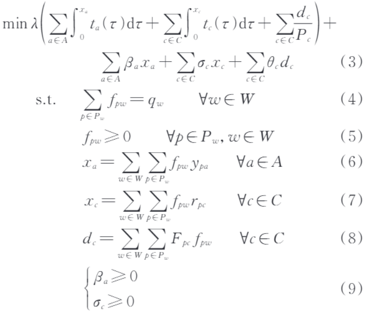
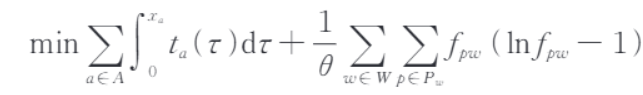
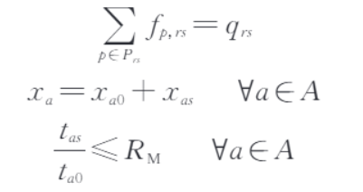
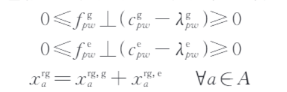
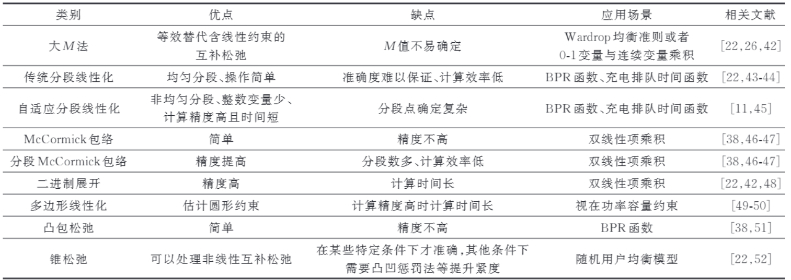
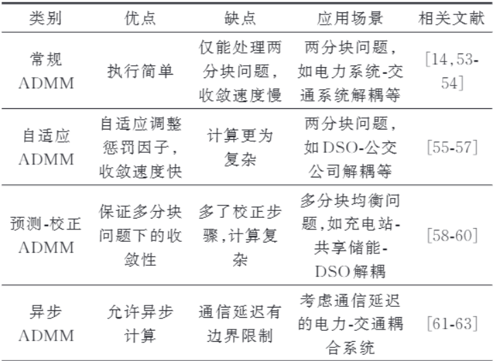
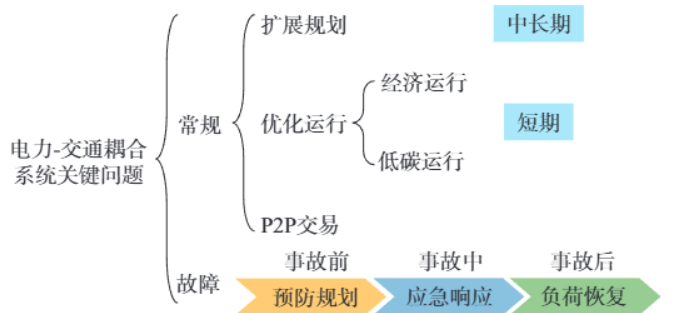

# 电力-交通融合研究综述：模型、算法与关键问题

论文：

> [1]杨蒙,陈玥,徐潇源,等.电力-交通融合研究综述：模型、算法与关键问题[J].电力系统自动化,2025,49(9):1-16.

## 研究背景

作为一篇综述论文，文章开头总体指出电力交通二者耦合：从电力系统角度看，受交通网络结构、用户出行需求和道路阻塞状况等影响的EV充电负荷改变了电网潮流分布，给可控资源稀缺的配电网安全稳定运行带来新机遇。从交通系统角度看，充电站的容量和位置、充电速率、充电价格等因素也会影响用户出行路径选择和充电决策，并反过来影响交通流的实际分布。

而对于二者耦合的系统来说，由于主体众多而导致数据隐私与故障传播变得更为复杂，论文此后全面梳理了电力-交通领域当前研究进展。

## 耦合系统架构与模型

首先，耦合系统的主体包含：电网运营商、交通管理部门、车主、充电站运营商，考虑不同主体之间的关系建立不同的耦合架构模型，比如：

1. 在电网-EV架构下，电网考虑配电网充电负荷、负荷需求、安全运行，车主考虑出行路径和充电决策
2. 在此基础上，加入充电桩运行商等中间利益主体，其特征是考虑自身利益最大，从上层购电售电，往下层引导充电调度
3. 将中间利益主体替换为交通运营商则是另一种架构，其引导车流分布降低出行成本，无论是统一管理还是独立运营，其目的都是引导交通流和充电负荷分布
4. 在上层再加入政府设置限制并协调系统运行是第四种架构，政府优化费用限制，中层运营商以利益为目标设置费用，下层再根据费用进行车流分布

电网模型目前多为二阶锥松弛模型或线性化配电网交流最优潮流模型，而交通模型按照时间尺度的15min和90min分为静态，半动态，动态三类：

1. 静态模型分为几类，第一类是经典用户均衡模型，遵循Wardrop均衡原则，平衡条件是所有正在使用的路径具有相同的出行成本，且这一成本为所有可能路径中的最小值；同时，任何未被使用的路径的出行成本都不低于这个最小值，以下是考虑各项成本的模型
   
2. 在考虑到现实车主对出行成本有一定认知偏差，随机用户均衡模型将误差假设为独立一致的Gumbel分布
   
3. 再考虑到交通事故发生导致事故路段关闭后，事故附近的交通流会重新分配
   
4. 再考虑到GV和EV混合存在时，将道路分为常规道路、充电道路、辅助道路，将流量更新如下
   
5. 此外，考虑到运营商或调度平台在上层调度或其他情况，可以建立更多的模型

动态模型主要考虑短期交通流预测与控制，可以提供准确的交通动态信息。其原理主要是考虑交通单路流量和单个节点流入流出守恒。

半动态模型类似于折中，计算目标流量和剩余差值以修正出行需求。

## 三大挑战

相较于一般电力需求响应问题，电力-交通系统中交通网络模型存在着更多的非凸非线性项，例如排队等待时间函数项、路段自由行驶时间函数项、碳排放函数项等，应对这一挑战，现有研究常采用线性化和凸松弛两类方法近似得到可高效求解的模型：


电力系统和交通系统由不同主体管理，为保持其决策的独立性，现有研究主要使用交替方向乘子法（ADMM）：


而对于隐私泄露的问题，可以应用同态加密，差分隐私等技术，或可以采用联邦学习减少数据传输保护隐私。

电力-交通耦合系统中存在着大量的不确定性，应对不确定性的传统方法包括随机优化、鲁棒优化、分布鲁棒优化等，近年来，强化学习算法如Q-学习、深度Q网络、双深度Q网络、深度确定性策略梯度算法等被广泛应用于电力-交通领域研究。

## 关键问题

此外，耦合系统还存在关键问题值得研究：


1. 在数年、年等长期时间尺度下，电力-交通耦合系统扩展规划对象包括电力线路、交通道路、发电、储能、无线充电路段、充电站等设施，以满足日益增长的电力与交通需求。
2. 在多日、日等短期时间尺度下，电力-交通耦合系统经济运行一般以经济成本最小为目标。其中，电网运行成本主要包括发电成本和向上级电网购电成本，交通网运行成本主要包括车辆总道路通行时间、充电站排队等待时间、充电时间等时间成本和道路通行费、充电电费等费用成本。
3. 碳排放是电力-交通耦合系统中不可忽视的部分，其一方面来自交通系统中GV的排放，另一方面来自EV充电时电力系统电源侧化石燃料产生的排放。
4. EV充电站具备一定的容量可以参与局域P2P市场交易，以促进分布式资源利用、提升运营利润。按照组织形式不同，主要分为DSO组织参与的和完全分散式的P2P交易两种形式。
5. 台风、地震等小概率-高损失事件的发生给电力系统和交通系统带来巨大威胁，增强电力-交通耦合系统的韧性以快速恢复极端事件后的电力负荷和交通出行十分必要。

## 研究展望

同时，作为2025年9月的文章，论文提出了很有价值的研究展望：

1. 无人驾驶技术赋能共享EV，既可以提供出行又可以作为移动储能资源
2. 氢能源的技术成熟为HFCV与EV互补的未来构筑前景
3. 移动充电站技术已经在国外初步使用但未商业化，其理念能在EV便利的时间地点提供服务

论文也解释了强化学习的优劣：

> 以强化学习为代表的数据驱动方法无须对复杂系统进行建模，通过与电力-交通耦合环境的反复交互获取经验，辅助智能体逐步学习到最优决策。深度Q网络、图学习等单智能体学习方法和多智能体深度确定策略梯度、分层混合多智能体深度强化学习等多智能体学习方法在电力-交通耦合相关研究中具有广阔应用前景［114-115］。大语言模型（largelanguagemodel，LLM）能够实现多模态数据融合，理解电力-交通相关事件（如天气变化、交通事故、国际会议等新闻报道）内部逻辑，其发展为解决电力-交通耦合系统问题提供了新思路，可提高出行需求和充电负荷预测适应性、电力-交通决策实际运行效率［116］。未来研究应关注数据质量和可用性、训练策略的安全性与鲁棒性、实际系统环境设置、数据泄露和网络攻击［117］等算法层面的问题，以及充电负荷时空预测、移动充电站路径优化与充放电调度、多充电站运营商定价博弈、充电站参与能量-辅助服务市场、耦合网络碳排和阻塞管理［118-120］等应用层面的问题。然而，数据驱动方法可能面临数据不足问题，生成对抗网络（generativeadversarialnetwork，GAN）、变分自动编码器（variationalautoencoder，VAE）、Transformer等传统数据生成模型存在模式崩溃、训练不稳定等问题，扩散模型（diffusionmodel）通过逆转扩散过程生成数据，在训练和推理方面非常高效［121-123］。未来研究可将去噪扩散模型、条件扩散模型等用于充电负荷、出行需求、新能源出力等场景生成中。

在现有模型过于依赖对不确定因素的预测时，可以尝试在线优化算法，在无须预测的情况下进行决策。

# Qiu等关于电动汽车在电力—交通耦合网络中提供多种服务以及分层混合多智能体强化学习方法的研究

论文：

> Dawei Qiu, Yi Wang, Mingyang Sun, Goran Strbac.
> Multi-service provision for electric vehicles in power-transportation networks towards a low-carbon transition: A hierarchical and hybrid multi-agent reinforcement learning approach.
> Applied Energy, 2022, 313: 118790.

电动汽车相较于传统资源有两个特点：EV不是固定在一个地方的，它可以在交通网络中移动;EV的电池可以在一定范围内调整充放电行为，因此可以为电力系统提供一定的调节能力。

EV之所以值得研究，不只是因为它是一个电负荷，而是因为它同时具有“移动”和“可调节”两个属性。

作者指出此前的研究多为利用V2G技术使得EV根据不同时段的电价进行套利，但是在商业模型中EV的属性没有被完全利用。作者提出本文的主要工作内容就是使得EV成为同时跨越交通系统和电力系统的资源，提供如下四种服务：

- charging service
- demand management service
- carbon intensity service
- balancing service

即本身的充电需求，调节配电网需求，参与碳强度调节，平衡调节服务。

同时，作者解释了使用强化学习模型的原因，此前EV的运行问题一般用的是基于模型的优化方法，但是这种方法的弊端是需要全局信息导致可能的隐私泄露且实时变化的双系统网络会使得模型优化比较耗时，作者希望不需要完整掌握环境模型，也能让EV自己学习决策。因而作者提出了一种方法：

> model-free hierarchical and hybrid multi-agent reinforcement learning

以学习EV的路径选择与调度决策 —— EV在交通网络中进行routing，在电力网络中进行scheduling。

在作者给出的具体算例中，提出的方法较传统算法在policy quality和convergence speed层面表现更好，也具有更强的泛化能力和扩展性。

## 研究背景

随着 DER 大量接入，尤其是风电、光伏等具有间歇性的 RES 大规模接入，传统电力系统那种相对集中、自上而下的运行方式面临更大的挑战，需要保证系统仍然具有可预测性、可靠性和可控性。因此，需要从供给侧和需求侧获得各种辅助服务。EV 属于需求侧技术，相比传统 DER，具有比较明显的mobility和flexibility，所以它可以参与辅助服务。但同时，EV同时存在于 power network 和 transportation network 中。以前很多研究虽然研究了EV的电力调度，也有研究研究EV的交通路径，但在“多服务提供”这个问题里，还没有很好地把这两件事真正结合起来。

已有研究已经广泛利用基于模型的优化方法研究EV提供各种辅助服务的能力，包括能量不平衡调节、运行备用、频率响应和电压响应等。但是也存在一些问题：

1. 很多研究采用基于场景的随机优化方法处理不确定性。在场景增加时计算量也会同步增加而导致无法实现同步决策。
2. 许多研究主要依赖能源管理系统（EMS）进行优化，这种方法无法同时描述EV在两个网络中的特征。
3. 对交通网络的建模仍然不够充分，很多工作没有真正建立包含交通流量、道路拥堵等因素的详细交通网络，而只是简单地利用EV出行时间的概率分布进行模拟。
4. 如上一篇文章所述，现有基于模型的优化方法通常要求掌握较完整的环境信息，现实环境中完全掌握这些信息并不现实。

## 强化学习

强化学习相比于传统模型有如下好处：

- model-free，不需要预先知道完整环境模型；
- 通过和环境反复交互学习；
- 可以利用不断产生的数据处理不确定性和状态变化；
- 训练完成后，策略执行很快，适合实时控制。

对于这种动态、随机、序贯决策的问题，RL会更为合适。

此前的单智能体强化学习由Q-learning发展到DRL而来，第二类研究针对的是多个智能体的问题，也就是采用多智能体强化学习（MARL）。但是集中执行实际上削弱了私人EV在智能电网中的自主控制能力。另一项研究让每一辆EV自己进行决策（distributed MARL），多个EV可以协调充电。上述研究已经成功把SARL和MARL应用到了很多EV电力调度问题中，但这些研究都忽略了交通网络，因此也没有考虑EV的routing决策。

如果能够进行高效的交通路径规划，就可以增加EV连接到电力网络的时间，从而让EV有更多时间提供辅助服务，进而更充分地利用EV的灵活性。

传统RL很难直接处这个问题，因为它同时存在两种不同的动作空间。交通系统的路径选择是离散的，电力网络的充放电是连续的，首先要决定EV现在到底处于 routing 还是 scheduling 状态，然后再决定具体执行什么动作。这篇文章提出一种分层、混合的多智能体强化学习方法。首先通过上层（UL）策略决定EV当前应该在交通网络中进行 routing，还是在电力网络中进行 scheduling；然后再通过下层（LL）的混合策略，分别处理 routing 所对应的离散动作和 scheduling 所对应的连续动作。

同时，作者声明他做了如下创新工作：

- 采用去中心化部分可观测马尔可夫决策过程（Dec-POMDP）来描述多个EV协同提供多种服务的问题：EV在配电网络中的充电服务；为配电网运营商（DNO）提供需求管理服务；为国家电网层面的系统提供碳强度服务；为系统运营商提供向上、向下平衡服务（up-BS / down-BS）。并将这个问题拆解为多个EV分散决策、信息不完全、彼此影响的决策系统。
- 在这个 Dec-POMDP 的仿真环境中，同时考虑交通网络和电力网络，以更加真实地描述EV的决策过程。交通网络用模型描述交通时间和拥堵情况，电力网络用linearized AC-OPF 来描述高比例可再生能源接入带来的电力系统运行影响。
- 作者提出的新的MARL算法名为H2PSPPO —— 分层结构-混合策略-多智能体-Proximal Policy Optimization优化方法-Parameter Sharing框架。同时利用一种集体价格指标来代表整个系统的动态，并同时进行隐私保护。
- 同时作者进行了大量真实数据与案例的计算

## 研究意义

EV车主和运营商可以把这种多服务模式加入自己的日常使用中，通过智能控制参与多种服务。既可能获得经济收益，又可以提高电网灵活性；推动EV接入电力系统。

政策制定者，电力系统运营商可以利用这个模型评估：成本收益分析；环境效益分析；EV规模化部署分析。

这种 MARL 方法也可以推动未来电力—交通系统中的机器学习方法发展。、

## 问题建模

文章研究的是在一个电力—交通耦合网络中，EV为了提供多种服务而进行的路径选择（routing）和调度（scheduling）问题。系统分为三个层次

- Transportation network
  Power network
  Communication network

EV可以在不同的交通节点之间移动，并通过充电站选择接入某些电力网络中的电气母线。

作者假设每辆EV每天有两次典型出行：

> 早上：home → office
> 晚上：office → home

EV只有在连接到电力网络之后，才能提供电力服务——routing 和 scheduling 不是同时进行的。

作者在一些母线上配置了不同的 DER / 电力资源，包括：

- electric demand：电力负荷
  diesel generators（DG）：柴油发电机
  wind turbines（WT）：风机
  photovoltaics（PV）：光伏

同时，EV通过充电桩接入网络进行充放电并提供多种前文所述的电力服务。

### EV的routing和scheduling

给定EV的出发地点、到达地点以及出发时间，可以确定EV在交通网络中的路径选择行为。

例如：

> 早上7:30从家出发去公司。

作者用一个二进制变量表示：

$$
u^{rd}_{i,r,t}\in\{0,1\}
$$

> 第 \(i\) 辆EV在时间 \(t\) 是否选择道路 \(r\)。

- \(u^{rd}\_{i,r,t}=1\)：在这段时间走道路 \(r\)
- \(u^{rd}\_{i,r,t}=0\)：不走道路 \(r\)

$$
\sum_{r\in R}u^{rd}_{i,r,t}=1
$$

> **一辆EV在一个时间步只能处于一条道路上。**

目标函数(2)：

$$
\min \sum_{r\in R_o}\sum_{t\in T}
\mathbb E[
u^{rd}_{i,r,t}T^{trl}_{r,t}
]
$$

> **希望最小化EV完成个人出行所需要的总通勤时间，考虑交通流量变化之后，寻找预期通勤时间较小的路线。**

其中：

- \(R_o\)：这辆EV这次出行实际可能经过的路线集合
- \(T^{trl}\_{r,t}\)：道路 \(r\) 在时间 \(t\) 的行驶时间
- \(\mathbb E\)：期望，因为交通流量具有不确定性

作者还特别说明，道路上的交通流量不仅包括普通车辆，还包括研究中的EV自身。

作者接下来定义：

$$
E^{con}_{i,t}
=
\sum_{r\in R_o}
P(V^{avg}_{r,t})T^{trl}_{r,t}
$$

> EV完成这段行程需要消耗多少电能。

其中：

- \(V^{avg}\_{r,t}\)：道路平均速度
- \(T^{trl}\_{r,t}\)：道路行驶时间
- \(P(V^{avg})\)：车辆在该平均速度下对应的功率

所以逻辑是：

$$
\text{行驶功率}\times\text{行驶时间}
=
\text{交通过程中的能耗}
$$

接下来作者开始定义EV接入电网后的情况。

这里首先出现两个功率变量：

- \(P^c\_{i,t}\)：充电功率
- \(P^d\_{i,t}\)：放电功率

其中放电功率 \(P^d\) 是负数。

作者定义：

$$
u^{ev}_{i,t}\in\{0,1\}
$$

其中：

- \(u^{ev}=1\)：充电
- \(u^{ev}=0\)：放电

另外还有一个变量：

$$
A_{i,t}\in\{0,1\}
$$

表示：EV此时有没有连接到电网。

- \(A=1\)：connected
- \(A=0\)：not connected

而这个 \(A\_{i,t}\) 又是由前面的 routing 决定的。

下一个公式描述EV的充电：

$$
0\le P^c_{i,t}
\le
u^{ev}_{i,t}A_{i,t}\bar P_i
$$

只有在“接入电网 + 处于充电状态”时，EV才能充电。

如果：

- \(u^{ev}=1\)
- \(A=1\)

那么：

$$
0\le P^c\le\bar P
$$

可以正常充电。

而只要其中任一个是0，则：

$$
P^c=0
$$

控制放电：

$$
(u^{ev}_{i,t}-1)A_{i,t}\bar P_i
\le P^d_{i,t}\le0
$$

首先当 \(u^{ev}=1\) 时：

$$
P^d=0
$$

也就是不能一边充一边放。

当 \(u^{ev}=0,\ A=1\) 时：

$$
-\bar P_i\le P^d\le0
$$

于是可以放电。

接下来作者定义up-BS： 减少当前充电，或者增加当前放电。

定义 \(B^u\_{i,t}\) 表示EV能提供的向上调节能力 / 上调备用容量。

而 \(B^d\_{i,t}\) 就是：向下调节能力 / 下调备用容量。

BS容量受到EV最大功率限制，同时还必须考虑当前已经安排好的充放电功率。

这篇论文里，作者用 \(S^{ev}\_{i,t}\) 表示 EV \(i\) 在时刻 \(t\) 的电池能量状态，并用它来约束 EV 能提供多少充放电和辅助服务。

$$
SOC=\frac{\text{当前电池剩余能量}}{\text{电池容量}}
$$

假如一辆车当前SOC已经很低，它即使功率上还有能力放电，也不能无限提供向上服务。反过来：如果SOC已经很高，也不能无限继续充电。因此作者对BS的能量水平又增加了电池容量和SOC约束。

同时约束SOC范围：

$$
0\le S^{ev}_{i,t}\le \bar S_i
$$

即EV当前储能状态必须位于允许范围内。

当 \(A\_{i,t}=1\)，也就是EV接入电网时：

$$
S^{ev}_{i,t+1}
=
S^{ev}_{i,t}
+
\frac{
P^c_{i,t}\eta_c
+
P^d_{i,t}/\eta_d
}{\bar E_i}\Delta t
$$

当前SOC + 充电增加的能量 + 放电减少的能量。

当 \(A\_{i,t}=0\)，即EV不接电网、正在路上：

$$
S^{ev}_{i,t+1}
=
S^{ev}_{i,t}
-
\frac{E^{con}_{i,t}}{\bar E_i}
$$

则开车消耗多少电，SOC就下降多少。

```text
交通网络
↓
路线
↓
行驶时间 / 速度
↓
交通能耗 E_con
↓
SOC下降
↓
后续能否继续出行 / 提供电力服务
```

与此同时：

```text
电力网络
↓
充放电
↓
SOC变化
↓
影响EV后面的交通能力
```

用一个分情况方程把“接电时充放电”和“行驶时消耗能量”统一起来。

EV希望最小化自己的expected net cost：期望净成本。

这里包括四类经济量：

1.买电充电——EV从配电网买电，

2.参与需求管理——例如系统需要削减高峰需求，EV通过放电等方式参与，

3.碳强度服务：EV把电能卖回国家电网、响应碳强度信号，

4.提供 up-BS / down-BS：EV向系统运营商承诺备用调节能力然后根据备用容量获得收入。

$$
\text{EV净成本}
=
\text{买电成本}
-
\text{各种服务收入}
$$

其中：

$$
\lambda^{lmp}_{b,t}(P^c+P^d)
$$

是通过节点电价 LMP 计算电能交易产生的成本/收益。

因为这里 \(P^d<0\)，所以放电的时候这一项会变成负值，相当于卖电获得收入。

而：

$$
-\lambda_b(B^u+B^d)
$$

则对应提供上下平衡服务得到的收入。

作者接下来解释配电网运营商（DNO）负责，在每个时间步管理电网资源，平衡节点上的供需。

然后DNO把Locational Marginal Price（LMP）节点边际电价发布给停在对应母线的EV。不同位置的EV，面对的电价可能不同。

而 up-BS / down-BS 是系统运营商另外采购的服务，所以它的收益直接按 \(\lambda_b\) 计算。

```text
                交通网络
                   │
                Routing
                   ↓
          走哪条路 / 何时到达
                   ↓
              交通能耗
                   ↓
                  SOC
                   ↑
                   │
        ┌──────────┴──────────┐
        │                     │
     Charging              Discharging
        │                     │
        └──────────┬──────────┘
                   ↓
             电力网络服务
       ┌──────────┼──────────┐
       ↓          ↓          ↓
    Demand      Carbon      Balancing
   management  intensity    up/down
```

Routing 决定 EV 什么时候、在哪里能够参与电力服务，同时产生交通能耗；Scheduling 决定 EV 如何利用电池参与电力服务，又反过来影响电池能量状态。

变量总结：

| 变量                | 含义                | 性质        |
| ------------------- | ------------------- | ----------- |
| \(u^{rd}\_{i,r,t}\) | EV是否选择道路\(r\) | 离散/二进制 |
| \(A\_{i,t}\)        | EV是否接入电网      | 离散/二进制 |
| \(u^{ev}\_{i,t}\)   | 充电还是放电        | 离散/二进制 |
| \(P^c\_{i,t}\)      | 充电功率            | 连续        |
| \(P^d\_{i,t}\)      | 放电功率            | 连续、负值  |
| \(B^u\_{i,t}\)      | 向上平衡服务容量    | 连续        |
| \(B^d\_{i,t}\)      | 向下平衡服务容量    | 连续        |
| \(S^{ev}\_{i,t}\)   | EV电池能量/SOC状态  | 状态变量    |
| \(E^{con}\_{i,t}\)  | 出行能耗            | 连续        |

### 交通网络建模

本文采用 O-D（Origin-Destination）网络描述EV的交通行为。交通网络由若干个起点—终点（O-D）对构成，在本文中分别对应 EV 的两类日常出行：

Home → Office
Office → Home

每个 O-D 对之间存在多条可选路线（route），而每条路线又由若干条道路（road）组成。EV在交通网络中根据实时交通状态进行路径选择。

对于道路 \(r\)，其在时间 \(t\) 的行驶时间记为 \(T^{trl}\_{r,t}\)。由于交通流量随时间变化，同一道路在不同时刻具有不同的行驶时间。

本文采用基于美国 Bureau of Public Roads 的交通流模型描述交通流量与道路行驶时间之间的关系：

$$
T^{trl}_{r,t} = T^{trl,0}_{r} \left[ 1+ \alpha^{rd}_{r} \left( \frac{V^{rd}_{r,t}}{C_r} \right)^{\beta^{rd}_{r}} \right], \qquad \forall t\in T,\forall r\in R \tag{13}
$$

其中：

\(T^{trl,0}_{r}\)：道路 \(r\) 在自由流状态下的行驶时间；
\(V^{rd}_{r,t}\)：道路 \(r\) 在时间 \(t\) 的实时交通流量；
\(C*r\)：道路 \(r\) 的通行容量；
\(\alpha^{rd}*{r},\beta^{rd}\_{r}\)：描述交通拥堵特性的参数。

该模型表达了交通流量增加时道路行驶时间随之增加的关系，同时能够反映交通流本身所产生的道路阻抗。

对于一条完整路线 \(k\)，其由若干道路组成。定义：

$$
T^{trl}_{k,t} = \sum_{r\in R} T^{trl}_{r,t}\Theta_{r,k}, \qquad \forall t\in T,\forall k\in R_o \tag{14}
$$

其中，\(\Theta\_{r,k}\) 用于表示道路 \(r\) 是否属于路线 \(k\)：

$$
\Theta\_{r,k}= \begin{cases} 1,&r\text{属于路线 }k\\ 0,&r\text{不属于路线 }k \end{cases}
$$

因此，路线的总行驶时间就是其所经过各道路行驶时间之和。

道路的实时交通流量由两部分构成：

- 其他类型车辆形成的基础交通流量；
  当前在该道路上行驶的EV。

具体表示为：

$$
V^{rd}_{r,t} = d^{rd}_{r,t} + \sum*{i\in I}u^{rd}*{i,r,t}, \qquad \forall t\in T,\forall r\in R \tag{15}
$$

其中：

\(d^{rd}_{r,t}\)：道路 \(r\) 在时间 \(t\) 的基础交通流量，即其他类型车辆形成的交通流；
\(u^{rd}_{i,r,t}\)：前述EV路径选择变量，表示EV \(i\) 在时间 \(t\) 是否位于道路 \(r\)。

因此，EV自身的路径选择会直接影响道路交通流量，而交通流量又会影响道路行驶时间。由此形成：

$$
\text{EV routing} \rightarrow \text{traffic volume} \rightarrow \text{travel time} \rightarrow \text{EV routing}
$$

这意味着多个EV之间并非完全独立地进行路径选择：一个EV进入某条道路后，会增加该道路的交通流量，并可能影响其他EV后续的路径决策。

在得到道路行驶时间后，可以进一步计算道路平均速度：

$$
V^{avg}_{r,t} = \frac{L_r}{T^{trl}_{r,t}}, \qquad \forall t\in T,\forall r\in R \tag{16}
$$

其中 \(L_r\) 为道路 \(r\) 的行驶距离。

因此，交通网络模型形成了完整的计算链：

$$
u^{rd}_{i,r,t} \rightarrow V^{rd}_{r,t} \rightarrow T^{trl}_{r,t} \rightarrow V^{avg}_{r,t}
$$

在前一节中，平均速度和行驶时间进一步用于计算EV的交通能耗 \(E^{con}\_{i,t}\)，因此交通网络最终会影响EV的电池能量状态。

因而对于交通网络来说，文章结构大致是这样：

$$
\boxed{ \text{Routing} \rightarrow \text{Traffic} \rightarrow \text{Travel time} \rightarrow \text{Speed} \rightarrow \text{Energy consumption} \rightarrow \text{SOC} }
$$

同时，由于EV本身也会进入交通流量计算，因此这一关系又具有反馈性。这使得交通网络成为后续多EV协同决策环境的重要组成部分。

### 电力网络建模

为了将EV的出行行为进一步纳入配电网络，本文采用线性化AC-OPF（linearized AC optimal power flow）建立电力网络模型，并由配电网运营商（DNO）在每个时间步进行电力系统运行优化。

作者采用线性化AC-OPF主要是为了在计算效率和模型精度之间取得平衡：相比非线性AC-OPF，可以降低后续MARL训练过程中的计算开销；相比DC-OPF，则能够保留更加准确的电力潮流信息，从而使EV得到更加真实的routing和scheduling反馈。

当EV \(i\) 停靠在对应的充电站，并根据自己的决策确定充电功率 \(P^c*{i,t}\) 或放电功率 \(P^d*{i,t}\) 后，DNO在每个时间步 \(t\) 求解线性化AC-OPF。

AC-OPF的目标函数为：

$$
\min*{\Xi*{opf}} \mathbb{E} \left[ \sum_{g\in G} \lambda^{dg}_{g,t}P^{dg}_{g,t} + \sum_{b\in B_{gd}} \lambda^g_tP^+_{b,t} + \sum_{b\in B_{gd}} \lambda^c_t\lambda^eP^-_{b,t} \right] \tag{17}
$$

其中，\(\Xi\_{opf}\)表示AC-OPF中的全部决策变量：

$$
\Xi*{opf} = \{ P^+*{b,t}, P^-_{b,t}, U_{b,t}, P^{cur}_{g,t}, P^{dg}_{g,t}, Q^{dg}_{g,t}, P^{ex}_{b,t}, Q^{ex}_{b,t}, P_{bp,t}, Q*{bp,t}, V^2*{b,t}, \delta\_{bp,t} \} \tag{18}
$$

目标函数主要包含三个部分：

- DG发电成本；
  从主电网购电的成本；
  向主电网出售剩余电能所获得的收益。

其中 \(P^+_{b,t}>0\) 表示从主电网购电，\(P^-_{b,t}<0\) 表示向主电网送电。

作者进一步对这些量取期望，以考虑电力需求、风电、光伏、线路故障以及交通流量等不确定因素。

首先需要满足配电网络中的有功功率平衡：

$$
\begin{aligned} &\sum*{b\in B*{gd}} (P^+_{b,t}+P^-_{b,t}) -\sum*{i\in B*{ev}} (P^d*{i,t}+P^c*{i,t}) \\ &+\sum*{g\in B*{dg}}P^{dg}_{g,t} +\sum_{g\in B*{wt}} (P^{wt}*{g,t}-P^{cur}_{g,t})\\ &+\sum_{g\in B*{pv}} (P^{pv}*{g,t}-P^{cur}_{g,t})\\ &= P^{ex}_{b,t} + \sum*{d\in B*{ed}}P^{ed}\_{d,t}, \qquad \forall b\in B \end{aligned} \tag{19}
$$

系统中所有发电、购电和EV放电提供的功率，要与负荷、EV充电以及向外送出的功率保持平衡。

对应的无功功率平衡为：

$$
\sum*{g\in B*{dg}}Q^{dg}_{g,t} = Q^{ex}_{b,t} + \sum*{d\in B*{ed}}Q^{ed}\_{d,t}, \qquad \forall b\in B \tag{20}
$$

式（19）的对偶变量：

$$
\lambda^{lmp}\_{b,t}
$$

就是节点边际电价（Locational Marginal Price, LMP）。

节点与相邻线路之间的功率关系进一步表示为：

$$
Q^{ex}_{b,t} = \sum_{(b,p)\in L}Q*{bp,t} - \left(\sum*{p\in B}B*{bp}\right)V^2*{b,t}, \qquad \forall b\in B \tag{22}
$$

其中：

\(P*{bp,t}\)：线路 \(b-p\) 上的有功潮流；
\(Q*{bp,t}\)：线路 \(b-p\) 上的无功潮流；
\(V^2*{b,t}\)：节点电压平方；
\(G*{bp},B\_{bp}\)：线路参数。

进一步地，线路有功、无功潮流采用线性化形式：

$$
Q*{bp,t} = -B*{bp} \frac{V^2*{b,t}-V^2*{p,t}}{2} - G*{bp}\delta*{bp,t} + Q^{lo}\_{bp,t}, \qquad \forall\,bp=l\in L \tag{24}
$$

其中 \(P^{lo}_{bp,t}\) 和 \(Q^{lo}_{bp,t}\) 为通过损耗因子线性化得到的有功、无功损耗。

节点电压需要满足上下限：

$$
\underline{V}^{2} \le V^2\_{b,t} \le \overline{V}^{2}, \qquad \forall b\in B \tag{25}
$$

线路还要受到热容量限制：

$$
P^2*{bp,t}+Q^2*{bp,t} \le S^{lim}\_{bp}, \qquad \forall bp=l\in L \tag{26}
$$

DG的有功、无功出力分别受到上下限约束：

$$
\underline{P}^{dg}_{g} \le P^{dg}_{g,t} \le \overline{P}^{dg}_{g}, \qquad \forall g\in G \tag{27}
$$

$$
\underline{Q}^{dg}_{g} \le Q^{dg}_{g,t} \le \overline{Q}^{dg}\_{g}, \qquad \forall g\in G \tag{28}
$$

对于风电和光伏，还需要限制弃电量：

$$
0\le P^{cur}_{g,t}\le P^{wt}_{g,t}, \qquad \forall g\in W \tag{29}
$$

$$
0\le P^{cur}_{g,t}\le P^{pv}_{g,t}, \qquad \forall g\in P \tag{30}
$$

总结一下即电压不能越界、线路不能过载、发电机不能超出出力范围，同时风电和光伏的弃电也受到当前可用出力的约束。

配电网络还需要考虑与主电网之间的功率交换。

定义二进制变量：

$$
U\_{b,t}\in\{0,1\}
$$

其中：

\(U*{b,t}=1\)：从主电网购电；
\(U*{b,t}=0\)：向主电网送电。

因此：

$$
0\le P^+_{b,t} \le U_{b,t}\overline{P}^{g+}, \qquad \forall b\in B*{gd} \tag{31}
$$

$$
(U*{b,t}-1)\,\overline{P}^{g-} \le P^-*{b,t} \le 0, \qquad \forall b\in B\_{gd} \tag{32}
$$

$$
U*{b,t}\in\{0,1\}, \qquad \forall b\in B*{gd} \tag{33}
$$

这组约束保证在一个时间步内，系统在主电网侧进行的是购电或售电中的一种状态。

EV的充放电功率是EV自己的决策，但这个决策会直接进入电力系统的功率平衡。

也就是说：

$$
P^c*{i,t},P^d*{i,t}
$$

不是DNO替EV决定的，而是EV agent根据自己的策略决定之后，再作为电力网络优化的输入。

然后DNO根据所有EV的充放电行为以及其他电网资源，求解AC-OPF，得到整个配电网的运行状态和LMP，这个关系可以表述为：

$$
\boxed{ EV\text{ scheduling} \rightarrow AC\text{-}OPF \rightarrow \text{power system state} \rightarrow LMP \rightarrow EV\text{收益/决策} }
$$

这就是电力侧的核心耦合关系。

这里作者还处理了一个比较特殊的数学问题。

原始的 AC-OPF（17）–（33）包含二进制变量 \(U\_{b,t}\)，因此属于混合整数线性规划问题。由于强对偶性不能直接保证，原始问题不能直接得到对应的对偶变量，也就无法直接得到LMP。

作者因此采用两步方法：

第一步：

先求解原始MILP，得到二进制变量 \(U\_{b,t}\) 的最优值。

第二步：

固定第一步获得的 \(U\_{b,t}\)，重新求解对应的连续优化问题，再得到：

$$
\lambda^{lmp}\_{b,t}
$$

即节点边际电价。

到这里，电力网络这一侧可以总结成：

$$
\boxed{ EV\text{充放电决策} \rightarrow \text{节点功率平衡} \rightarrow \text{线路潮流/电压等约束} \rightarrow \text{DNO优化} \rightarrow LMP }
$$

再和前面的交通网络结合起来：

Routing→交通流量→行驶时间→交通能耗→SOC→Scheduling→AC-OPF→LMP

变量总结：

| 符号        | 含义                     | 直观理解             |
| ----------- | ------------------------ | -------------------- |
| \(B\)       | 电力网络中的所有母线集合 | 所有节点             |
| \(L\)       | 电力网络中的所有线路集合 | 节点之间的线路       |
| \(G\)       | 发电机集合               | 各类发电设备         |
| \(B\_{ed}\) | 含电力负荷的母线集合     | 哪些节点有负荷       |
| \(B\_{dg}\) | 连接DG的母线集合         | 柴油机所在节点       |
| \(B\_{wt}\) | 风电机组所在母线集合     | 风机所在节点         |
| \(B\_{pv}\) | 光伏所在母线集合         | 光伏所在节点         |
| \(B\_{ev}\) | EV所在母线集合           | EV当前接入的节点     |
| \(B\_{gd}\) | 与主电网连接的母线集合   | 配电网与大电网连接点 |
| \(t\)       | 时间步                   | 当前时刻             |
| \(i\)       | EV编号                   | 第\(i\)辆车          |
| \(g\)       | 发电机编号               | 第\(g\)台机组        |
| \(b,p\)     | 母线编号                 | 两个节点             |
| \(l\)       | 线路编号                 | 某条线路             |

| 符号               | 含义                       | 正负/性质               |
| ------------------ | -------------------------- | ----------------------- |
| \(P^c\_{i,t}\)     | EV\(i\)的充电功率          | \(>0\) 表示充电         |
| \(P^d\_{i,t}\)     | EV\(i\)的放电功率          | 本文约定\(<0\) 表示放电 |
| \(P^{dg}\_{g,t}\)  | DG\(g\)的有功出力          | 发电                    |
| \(Q^{dg}\_{g,t}\)  | DG\(g\)的无功出力          | 无功功率                |
| \(P^{wt}\_{g,t}\)  | 风电实际有功出力           | 风电                    |
| \(P^{pv}\_{g,t}\)  | 光伏实际有功出力           | 光伏                    |
| \(P^{cur}\_{g,t}\) | 可再生能源弃电功率         | 没有被利用的风/光电     |
| \(P^+\_{b,t}\)     | 从主电网向配电网购入的功率 | \(>0\) 表示进口         |
| \(P^-\_{b,t}\)     | 从配电网向主电网送出的功率 | \(<0\) 表示出口         |
| \(P^{ex}\_{b,t}\)  | 母线\(b\)的有功功率交换量  | 网络交换功率            |
| \(Q^{ex}\_{b,t}\)  | 母线\(b\)的无功功率交换量  | 网络交换功率            |
| \(P\_{bp,t}\)      | 线路\(b-p\)上的有功潮流    | 在线路上传输            |
| \(Q\_{bp,t}\)      | 线路\(b-p\)上的无功潮流    | 在线路上传输            |
| \(P^{lo}\_{bp,t}\) | 线路有功损耗的线性化表示   | 损耗                    |
| \(Q^{lo}\_{bp,t}\) | 线路无功损耗的线性化表示   | 损耗                    |
| \(P^{ed}\_{d,t}\)  | 负荷\(d\)的有功需求        | 负荷                    |
| \(Q^{ed}\_{d,t}\)  | 负荷\(d\)的无功需求        | 负荷                    |

这些量共同构成了式（19）中的节点功率平衡和式（23）–（24）中的线路潮流模型。

| 符号                             | 含义                         | 直观理解         |
| -------------------------------- | ---------------------------- | ---------------- |
| \(V^2\_{b,t}\)                   | 母线\(b\)的电压平方          | 节点电压状态     |
| \(\underline V^2,\overline V^2\) | 电压平方上下限               | 电压不能越界     |
| \(\delta\_{bp,t}\)               | 母线\(b,p\)之间的电压相角差  | 两节点相角差     |
| \(G\_{bp}\)                      | 线路\(b-p\)的电导参数        | 线路参数         |
| \(B\_{bp}\)                      | 线路\(b-p\)的电纳参数        | 线路参数         |
| \(S^{lim}\_{bp}\)                | 线路\(b-p\)的容量/热容量上限 | 线路最大承载能力 |

式（25）限制节点电压，式（26）限制线路容量。

| 符号                     | 含义                                   | 你可以怎么理解              |
| ------------------------ | -------------------------------------- | --------------------------- |
| \(U\_{b,t}\)             | 主电网交换状态的二进制变量             | 1=购电，0=售电              |
| \(\overline P^{g+}\)     | 主电网购电最大功率                     | 最多买多少                  |
| \(\overline P^{g-}\)     | 主电网送电最大功率                     | 最多卖多少                  |
| \(\lambda^g_t\)          | 电力市场购电价格                       | 从大电网买电的价格          |
| \(\lambda^c_t\)          | 碳强度信号                             | 当前电能的碳强度            |
| \(\lambda^e\)            | 碳价格                                 | 与碳排放相关的价格          |
| \(\lambda^{lmp}\_{b,t}\) | 母线\(b\)、时刻\(t\)的节点边际电价 LMP | 当前节点多1单位电的边际价值 |

其中 \(U\_{b,t}\) 通过式（31）–（33）控制系统处于购电还是售电状态。

精简版：

| 符号              | 含义              |
| ----------------- | ----------------- |
| \(P\)             | 有功功率          |
| \(Q\)             | 无功功率          |
| \(P^c\)           | EV充电功率        |
| \(P^d\)           | EV放电功率        |
| \(P^+\)           | 从主电网购电      |
| \(P^-\)           | 向主电网送电      |
| \(P^{dg}\)        | DG有功出力        |
| \(P^{wt}\)        | 风电出力          |
| \(P^{pv}\)        | 光伏出力          |
| \(P^{cur}\)       | 风/光弃电         |
| \(P*{bp},Q*{bp}\) | 线路有功/无功潮流 |
| \(V^2\)           | 节点电压平方      |
| \(\delta\)        | 节点电压相角差    |
| \(U\)             | 主电网购/售电状态 |
| \(\lambda^g\)     | 电价              |
| \(\lambda^c\)     | 碳强度信号        |
| \(\lambda^e\)     | 碳价格            |
| \(\lambda^{lmp}\) | 节点边际电价 LMP  |

### 使用MARL的原因（传统方法遇到的挑战）

直接做 model-based optimization会遇到三个问题。

第一个问题：信息和模型依赖

如果EV想直接根据前面的数学模型自己做最优决策，那么它得知道：

- 交通网络的数学模型；
  AC-OPF模型；
  各种技术参数。

否则EV根本不知道该怎么计算。同时如果EV并不属于交通系统或者电力系统运营商，那么EV自己的约束并没有直接整合进交通网络和电力网络的运营优化模型中，导致系统运营者和私人EV之间存在信息和控制边界。

第二个问题：现实环境太不确定

就算我们已经知道完整的数学模型和参数，现实中的交通和电力系统仍然存在大量不确定因素，例如：

- traffic volumes
  price signals
  electric demand
  renewable energy output

问题在于：

很难精确得到这些随机变量的概率分布。

例如风电到底有多大，不仅跟模型有关，还和天气有关；交通流量又和驾驶行为有关。

所以很难事先写出一个“完美的概率模型”把现实世界描述得很准确。

第三个问题：算起来太慢

最后，即使你把这些全部建模了：

这个优化问题本身太复杂。

因为它同时具有：

- 时间耦合；
  随机变量；
  整数变量；
  电力网络约束；
  交通网络约束；
  EV自身约束。

所以随着问题规模增加，直接求整个优化问题会非常耗时。

作者认为这不适合要求快速响应的多服务决策。

既然传统模型驱动优化既依赖完整模型和信息，又难以准确描述现实中的不确定性，而且求解速度可能不够快，那么就让EV通过与环境交互自己学习决策策略。作者采用：

> data-driven + model-free + MARL + decentralized decision-making

同时，作者强调这种方法能够避免EV之间以及EV与电力—交通网络之间进行过多的知识交换，从而保护隐私。

## 去中心化部分可观测马尔可夫决策过程

首先将电力–交通网络环境下、面向多服务提供的 EV 路径选择与调度问题，重新表述为一个具有离散时间步的有限去中心化部分可观测马尔可夫决策过程（Dec-POMDP）。

该 Dec-POMDP 定义为：

$$
\langle I,\mathcal S,\mathcal O,\mathcal A,\mathcal R,\mathcal T,\gamma\rangle
$$

其中包括：

- \(I\) 个 EV 智能体；
  全局状态集合 S
  局部观测集合 O
  动作集合 A
  奖励函数集合 R
  状态转移函数
  $$
  \mathcal T(s,a\_{1:I},\omega)
  $$

* 其受到环境状态 \(s\)、所有智能体的动作 \(a\_{1:I}\)，以及环境随机性 \(\omega\) 的影响。

这里的环境随机性 \(\omega\) 表示电力–交通网络中的不确定参数，例如：

交通流量；
价格信号；
电力需求；
可再生能源发电。

两个连续时间步之间的时间间隔为：

$$
\Delta t=30\text{ min}
$$

在时间步 \(t\)，每个智能体 \(i\) 根据自身的局部观测 \(o\_{i,t}\)，按照策略

$$
\pi(a*{i,t}|o*{i,t})
$$

选择动作 \(a\_{i,t}\)。

然后，环境根据状态转移函数 \(\mathcal T\) 进入下一状态。

与此同时，每个智能体 \(i\) 获得奖励 \(r*{i,t}\)，并获得新的局部观测 \(o*{i,t+1}\)。

这一过程不断重复，从而形成每个智能体 \(i\) 的轨迹：

$$
\tau*i = o*{i,1},a*{i,1},r*{i,1},o*{i,2},\ldots,r*{i,T}
$$

每个智能体的目标是最大化其累计折扣奖励：

$$
R*i=\sum*{t=0}^{T}\gamma^t r\_{i,t}
$$

其中：

$$
\gamma\in[0,1)
$$

为折扣因子。

整个一天的时间范围为：

$$
T=24\times2=48
$$

即每个时间步为 30 分钟，因此一天共有 48 个时间步。

变量总结：

| 符号           | 含义         | 在本文中对应什么             |
| -------------- | ------------ | ---------------------------- |
| \(I\)          | 智能体数量   | EV 的数量                    |
| \(\mathcal S\) | 全局状态空间 | 整个电力–交通系统的状态      |
| \(\mathcal O\) | 观测空间     | EV 能看到的局部信息          |
| \(\mathcal A\) | 动作空间     | EV 能采取的路径/调度动作     |
| \(\mathcal R\) | 奖励函数     | EV 执行动作后得到的收益/代价 |
| \(\mathcal T\) | 状态转移函数 | 动作执行后系统如何变化       |
| \(\gamma\)     | 折扣因子     | 当前奖励和未来奖励的权衡     |

由此看来，dec-POMOP 有如下显著特征：

- 每辆 EV 都是一个 agent，每个智能体都有自己的策略。
  每辆 EV 看不到整个系统的全部状态，系统信息共同构成系统的全局状态，但是 EV \(i\) 实际上只拿到自己的局部信息。
  下一时刻系统是什么状态，主要由当前状态 + 当前所有 EV 的动作 + 环境随机性决定。
  同时考虑交通流量、价格信号、电力需求、可再生能源出力等不确定因素
  智能体看到当前观测 \(o*{i,t}\) 后，决定采取动作 \(a*{i,t}\) 的策略。通过不断试错，学出一个好的 \(\pi\)。

### 环境状态和本地观测

论文定义：

$$
s*t=\{o*{1,t},\ldots,o\_{I,t}\}\in\mathcal S
$$

把所有 EV 的局部观测集合起来，构成环境状态。

单辆 EV \(i\) 的观测是 8 维：

$$
o*{i,t}= [ R^{rd}*{i,t}, V^{rd}_{i,t}, N^{rd}_{i,t}, P^{ed}_{i,t}, P^{res}_{i,t}, S^{ev}\_{i,t}, \lambda^g_t, \lambda^c_t ] \tag{34}
$$

可以分成两半：

$$
\boxed{\text{交通信息}}
$$

和

$$
\boxed{\text{电力信息}}
$$

交通侧是：

$$
R^{rd},V^{rd},N^{rd}
$$

分别对应：

当前所在/选择的道路信息；
这条路的交通流量；
EV 正在前往的终止节点。

电力侧是：

$$
P^{ed},P^{res},SOC,\lambda^g,\lambda^c
$$

即：

节点负荷；
可再生能源出力；
自己的 SOC；
电价；
碳强度信号。

这些信息可以使得EV基于此回答交通和电力侧的问题：

- 我下一步往哪个方向走？
  我现在应该充多少、放多少，以及提供多少上下调频/平衡服务？

### 行为

论文定义：

$$
a*{i,t} = [ a^{trl}*{i,t}, a^{pow}_{i,t}, a^{bsu}_{i,t}, a^{bsd}\_{i,t} ] \tag{35}
$$

四个动作：

| 动作               | 含义           | 类型 |
| ------------------ | -------------- | ---- |
| \(a^{trl}\_{i,t}\) | 路径方向选择   | 离散 |
| \(a^{pow}\_{i,t}\) | 充/放电功率    | 连续 |
| \(a^{bsu}\_{i,t}\) | up-BS 提供量   | 连续 |
| \(a^{bsd}\_{i,t}\) | down-BS 提供量 | 连续 |

其中路径动作：

$$
a^{trl}\_{i,t}\in\{0,1,2\}
$$

例如：

$$
0=\text{直行},\quad 1=\text{左转},\quad 2=\text{右转}
$$

在当前位置，根据交通网络拓扑，从当前节点可行的方向中选择下一步走向。

同时EV 不能在交通网络中行驶的同时，又在电力网络中提供辅助服务。

### 状态变化

在时刻 \(t\)，所有 EV 做完动作以后，需要得到 \(t+1\) 时刻的新状态：

$$
\boxed{ s*{t+1} = \mathcal T(o*{1:I,t},a\_{1:I,t},\omega_t) }
$$

下一状态=f(当前状态,所有EV动作,环境随机性)

作者把状态变化分成两类

#### 外生状态（exogenous）

这种状态不是 EV 自己的动作决定的，而是外部环境变化带来的。

作者前面列出的环境随机性

$$
\omega^t
$$

具有不确定性。

作者认为，与其先人为建立一个非常准确的概率模型，不如直接从历史数据/环境交互经验中学习这些不确定性的规律.

而 MARL 可以采用 data-driven 的方式，不要求提前得到底层不确定性的精确模型，而是从历史数据或环境交互经验中学习其概率特征。

#### 内生状态（endogenous）

这种状态是由 EV 自己的动作直接参与决定的状态。

比如SOC，这显然会被 EV 的驾驶状态和充放电状态改变。

- 下面具体说明一下公式

状态从时间步 \(t\) 到 \(t+1\) 的转移由

$$
s*{t+1}=\mathcal{T}(o*{1:I,t},a\_{1:I,t},\omega_t)
$$

决定。

在本文中，外生状态特征表示为

$$
\omega*t= [V^{rd}*{i,t},P^{ed}_{i,t},P^{res}_{i,t},\lambda^g_t,\lambda^c_t]
$$

这些变量主要描述交通流量、负荷、可再生能源出力、电价和碳强度信号等具有不确定性的环境因素。

对于接入电网的 EV，强化学习输出的归一化动作需要进一步转换为满足电池功率和 SoC 约束的实际充放电功率。

充电功率

$$
P^c*{i,t}= \begin{cases} \min\left( a^{pow}*{i,t}\bar P*i, \dfrac{(S_i-S^{ev}*{i,t})E*i}{\eta^c_i\Delta t} \right), & a^{pow}*{i,t}\geq0 \\[8pt] 0, & a^{pow}_{i,t}<0 \end{cases} \tag{36}
$$

放电功率

$$
P^d_{i,t}= \begin{cases} 0, & a^{pow}_{i,t}\geq0 \\[8pt] \max\left( a^{pow}_{i,t}\bar P*i, -\dfrac{S^{ev}*{i,t}E*i\eta^d_i}{\Delta t} \right), & a^{pow}*{i,t}<0 \end{cases} \tag{37}
$$

Up-BS 提供量

$$
B^u*{i,t}= \begin{cases} \min\left( \max\left( a^{bsu}*{i,t}(\bar P*i+P^c*{i,t}), \dfrac{(S^{ev}_{i,t}-S_i)E_i}{\Delta t}+P^c_{i,t} \right), \dfrac{S^{ev}_{i,t}E_i}{\Delta t}+P^c_{i,t} \right), & a^{pow}_{i,t}\geq0 \\[12pt] \min\left( \max\left( a^{bsu}_{i,t}(\bar P*i+P^d*{i,t}), \dfrac{(S*i-S^{ev}*{i,t})E*i}{\Delta t}+P^d*{i,t} \right), \dfrac{S^{ev}_{i,t}E_i}{\Delta t}+P^d_{i,t} \right), & a^{pow}_{i,t}<0 \end{cases} \tag{38}
$$

Down-BS 提供量

$$
B^d_{i,t}= \begin{cases} \min\left( \max\left( a^{bsd}_{i,t}(\bar P_i-P^c_{i,t}), -\dfrac{S^{ev}_{i,t}E_i}{\Delta t}-P^c_{i,t} \right), \dfrac{(S*i-S^{ev}*{i,t})E*i}{\Delta t}-P^c*{i,t} \right), & a^{pow}_{i,t}\geq0 \\[12pt] \min\left( \max\left( a^{bsd}_{i,t}(\bar P*i-P^d*{i,t}), -\dfrac{S^{ev}_{i,t}E_i}{\Delta t}-P^d_{i,t} \right), \dfrac{(S*i-S^{ev}*{i,t})E*i}{\Delta t}-P^d*{i,t} \right), & a^{pow}\_{i,t}<0 \end{cases} \tag{39}
$$

最后，EV 的 SoC 根据其是否接入电网进行状态转移：

$$
S^{ev}_{i,t+1}= \begin{cases} S^{ev}_{i,t} + \left( P^c*{i,t}\eta^c_i+ \dfrac{P^d*{i,t}}{\eta^d*i} \right) \dfrac{\Delta t}{E_i}, & A*{i,t}=1 \\[10pt] S^{ev}_{i,t}-E^{con}_{i,t}, & A\_{i,t}=0 \end{cases} \tag{40}
$$

其中：

$$
A\_{i,t}=1
$$

表示 EV 接入电力网络，此时 SoC 由充放电过程决定；

$$
A\_{i,t}=0
$$

表示 EV 正在交通网络中行驶，此时 SoC 因行驶能耗 \(E^{con}\_{i,t}\) 而下降。

因此，式（36）–（39）描述的是：

$$
\boxed{ \text{强化学习动作} \rightarrow \text{实际充放电功率及 BS 提供量} }
$$

而式（40）描述的是：

$$
\boxed{ \text{实际动作} \rightarrow \text{下一时刻 EV 的 SoC} }
$$

### 奖励函数

作者给每辆 EV 的目标概括成四部分：

- 少花时间开车
  少花钱充电
  通过放电提供 demand management / carbon service 获得收益
  通过 up-BS / down-BS 获得收益

具体公式是：

$$
r*{i,t} = -\kappa \left( u^{rd}*{i,r,t}T^{trl}_{r,t} \right) -\lambda^{lmp}_{b,t}P^c*{i,t} -\lambda^{lmp}*{b,t}P^d*{i,t} +\lambda_b(B^u*{i,t}+B^d\_{i,t}) \tag{41}
$$

其中：

$$
\forall i\in I,\quad \forall t\in T,\quad \forall r\in R^o,\quad \forall b\in B\_{ev}
$$

#### 驾驶时间

$$
-\kappa \left( u^{rd}_{i,r,t}T^{trl}_{r,t} \right)
$$

其中：

\(u^{rd}_{i,r,t}\)：EV \(i\) 此时是否选择道路 \(r\)
\(T^{trl}_{r,t}\)：道路 \(r\) 在时刻 \(t\) 的旅行时间
\(\kappa\)：权重系数

因为前面：

$$
u^{rd}\_{i,r,t}\in\{0,1\}
$$

所以：

如果 EV 没有走这条路：

$$
u^{rd}=0
$$

那么这一项就是 0。

如果 EV 走了这条路：

$$
u^{rd}=1
$$

那么：

$$
-\kappa T^{trl}
$$

开得越久，reward 越低。

所以强化学习自然会倾向于寻找更短的出行时间。

#### 充电成本

$$
-\lambda^{lmp}_{b,t}P^c_{i,t}
$$

如果 EV 充电：

$$
P^c>0
$$

那么：

$$
-\lambda^{lmp}P^c<0
$$

因此：

充电要付钱，所以 reward 降低。

这里使用LMP电价：

$$
\lambda^{lmp}\_{b,t}
$$

同前所述，LMP 不是 EV 自己随便定的，而是 DNO 在 EV 的充放电功率和接入位置确定后，通过 AC-OPF 求出来的。论文明确说明，\(\lambda^{lmp}_{b,t}\) 是在给定 \(P^c_{i,t},P^d*{i,t}\) 和 EV 所连接母线集合 \(B*{ev}\) 后，通过 AC-OPF 得到的。

#### 放电收益

$$
-\lambda^{lmp}_{b,t}P^d_{i,t}
$$

同前所述

$$
P^d\_{i,t}<0
$$

表示放电。

EV 把电送出去，可以获得收益。

因此前两项合起来就是充电花钱放电赚钱：

$$
-\lambda^{lmp}P^c - \lambda^{lmp}P^d
$$

#### 辅助服务收益

$$
+\lambda*b(B^u*{i,t}+B^d\_{i,t})
$$

这里：

\(B^u\)：up-BS commitment
\(B^d\)：down-BS commitment
\(\lambda_b\)：balancing service availability price

因为：

$$
B^u\geq0,\qquad B^d\geq0
$$

提供越多辅助服务容量，获得的奖励越高，注意这里奖励的是可提供的服务容量/承诺容量，而不只是实际发生的充放电电量。

#### 权重

$$
\kappa
$$

是一个 weighting factor，用来决定：

交通网络中节省旅行时间的重要程度，相对于电力网络商业收益的重要程度。

所以可以把整个 reward 看成：

$$
\underbrace{-\kappa T^{trl}}_{\text{不想堵在路上}} + \underbrace{(-\lambda^{lmp}P^c-\lambda^{lmp}P^d)}_{\text{充电成本/放电收益}} + \underbrace{\lambda*b(B^u+B^d)}*{\text{辅助服务收益}}
$$

## 多智能体强化学习算法

前面已经将 EV 的路径选择与电力调度问题重新建模为 Dec-POMDP。本节进一步讨论如何利用多智能体强化学习（MARL）求解该问题。作者提出一种名为 H2PSPPO 的 MARL 方法，其核心结构针对本文 EV 的具体决策特点进行了设计。

H2PSPPO 主要包含以下五个方面：

| 设计                                  | 作用                                                                      |
| ------------------------------------- | ------------------------------------------------------------------------- |
| Hierarchical architecture             | 通过分层结构，在 routing 和 scheduling 两种决策之间进行选择               |
| Hybrid policy                         | 同时处理 routing 的离散动作与 scheduling 的连续动作                       |
| PPO                                   | 使用 PPO 对策略进行训练，以提高采样效率、训练稳定性和超参数鲁棒性         |
| LMP-based option-state value function | 在 critic 中引入 LMP 作为系统状态的辅助表征，以提高训练的稳定性和可扩展性 |
| Parameter Sharing（PS）               | 所有 EV 共享策略参数，在保持分布式决策的同时利用所有 EV 的经验共同训练    |

前面已经指出，EV 的 routing 和 scheduling 是相互排斥的：

当 EV 在交通网络中行驶时，不能同时进行充放电和辅助服务；
当 EV 接入电网时，则不进行交通行驶。

因此，如果直接让一个策略在每个时间步同时输出 routing 和 scheduling 动作，其中必然有一部分动作在当前状态下没有实际意义。作者因此采用层次化强化学习（Hierarchical Reinforcement Learning，HRL），首先由上层策略决定当前应该进行哪一种决策，再由下层策略产生具体动作。

其基本结构为：

$$
o*{i,t} \rightarrow x*{i,t} \rightarrow a\_{i,t}
$$

其中：

\(o*{i,t}\)：EV \(i\) 的局部观测；
\(x*{i,t}\)：上层选择的 option；
\(a\_{i,t}\)：在该 option 下执行的具体动作。

本文设置两个 option：

$$
x\in \{ \text{routing}, \text{scheduling} \}
$$

作者采用 option framework，将一个 option 看作持续若干时间步的高层动作，而具体的 primitive action 则由下层策略执行。对于 agent \(i\)，上层 option policy 表示为：

$$
x*{i,t}=\mu(x|o*{i,t})
$$

在确定 option 后，EV 持续执行对应的低层策略，直到 option 被终止。终止策略表示为：

$$
m*{i,t}=\beta(m|o*{i,t})
$$

其中 \(m\) 表示 option 的终止状态。论文采用 call-and-return 的 option execution model，即选择 option 后持续执行该 option，直到终止，再重新选择新的 option。

作者表示这形成了：

$$
\boxed{ \text{Observation} \rightarrow \text{Option selection} \rightarrow \text{Primitive action} \rightarrow \text{Environment} }
$$

相比直接输出所有动作，这种层次结构能够明确区分“交通决策阶段”和“电力决策阶段”。

即使确定了 option，动作空间仍然存在一个问题。

Routing 动作属于离散空间：

$$
a^{trl}\_{i,t}\in\{0,1,2\}
$$

例如分别表示：

$$
\text{直行、左转、右转}
$$

而 scheduling 动作属于连续空间：

$$
a^{pow}\_{i,t}\in[-1,1]
$$

以及：

$$
a^{bsu}_{i,t},a^{bsd}_{i,t}\in[0,1]
$$

因此，本文的 action space 同时包含离散变量和连续变量。

作者将原始 observation 划分为两个部分：

$$
o*{i,t}=\{z*{i,t},e\_{i,t}\}
$$

其中交通网络 observation 为：

$$
z*{i,t} = [ R^{rd}*{i,t}, V^{rd}_{i,t}, N^{rd}_{i,t} ]
$$

电力网络 observation 为：

$$
e*{i,t} = [ P^{ed}*{i,t}, P^{res}_{i,t}, E^{ev}_{i,t}, \lambda^g_t, \lambda^c_t ]
$$

当 option 选择为 routing 时，使用 \(z*{i,t}\) 产生 routing 动作；当 option 选择为 scheduling 时，使用 \(e*{i,t}\) 产生 scheduling 动作。

因此，下层策略进一步拆成两种：

离散 actor 由参数 \(\phi^d\) 表示：

$$
k*{i,t} = \pi*{\phi^d}(k|z\_{i,t})
$$

其输出经过 Softmax，得到三个离散 routing 动作的概率，然后按照该分类概率分布采样具体动作。

连续 actor 由参数 \(\phi^c\) 表示：

$$
c*{i,t} = \pi*{\phi^c}(c|e\_{i,t})
$$

其输出对应连续动作的概率分布，并据此得到 scheduling 动作。

因此，整个低层策略可以概括为：

$$
a*{i,t} = \{k*{i,t},c\_{i,t}\}
$$

其中：

$$
k*{i,t} = [a^{trl}*{i,t}]
$$

$$
c*{i,t} = [a^{pow}*{i,t},a^{bsu}_{i,t},a^{bsd}_{i,t}]
$$

在上述层次结构和混合策略确定之后，还需要利用强化学习算法对各个策略进行训练。

作者选择 Proximal Policy Optimization（PPO） 对策略进行更新。论文指出，PPO 具有较好的采样效率、训练稳定性以及超参数鲁棒性，因此用于优化本文中的策略网络。

本文的另一个特点是在 critic 中引入 LMP 信息。

普通的 state-option value function 可以表示为：

$$
V\_\theta(o,x)
$$

表示在当前 observation \(o\) 下选择 option \(x\) 后所能获得的期望价值。

作者认为，仅使用 EV 的局部 observation 可能不足以描述整个电力–交通系统的动态状态，因此引入：

$$
\lambda
$$

构造：

$$
V\_\theta(o,x,\lambda)
$$

其中：

$$
\lambda=\lambda^{lmp}\_i
$$

表示 EV \(i\) 接入电网节点对应的 LMP；当 EV 正在交通网络中行驶时：

$$
\lambda=\mathrm{None}
$$

论文特别指出，当前时刻的 LMP 不能直接加入 actor 的 observation，因为 LMP 需要在 EV 做出当前动作后，由 DNO 根据 AC-OPF 计算得到。因此在当前决策时刻，EV 并不能提前获得这个 LMP；但在训练 critic 时，相关经验已经产生，此时可以使用 LMP 作为 critic 的输入。

这里的 \(\lambda\) 可以理解为一个对系统状态进行压缩表征的指标。由于 LMP 是经过 AC-OPF 后得到的，它间接包含了当前电网中负荷、发电、EV 充放电以及网络约束等信息，同时还能反映 EV 当前是否处于电网连接状态。论文将其视为能够捕获系统动态的 index。

本文包含多个 EV agent。如果每辆 EV 都独立训练一套完整的策略网络，训练成本会随 EV 数量增加。

由于本文中的 EV agent 具有相同的 observation、option、action 和 reward 结构，因此作者采用 Parameter Sharing（PS）。

即所有 EV 使用相同的策略参数：

$$
\pi_1=\pi_2=\cdots=\pi_I=\pi
$$

但每辆 EV 的局部观测不同：

$$
o*{1,t}\neq o*{2,t}\neq\cdots\neq o\_{I,t}
$$

因此即使使用相同的策略参数，不同 EV 仍然可以根据自身状态产生不同的动作：

$$
\pi(o*{1,t})\neq\pi(o*{2,t})
$$

训练过程中，各个 EV 与环境交互产生的 trajectory 都可以用于更新共享策略。这样既保持了每辆 EV 的分布式执行，又可以利用所有 EV 的经验加速训练。

综合上述设计，H2PSPPO 可以表示为：

$$
\boxed{ \text{Local Observation} \rightarrow \text{Option Policy} \rightarrow \text{Routing / Scheduling} \rightarrow \text{Hybrid Policy} \rightarrow \text{Action} \rightarrow \text{Environment} }
$$

其中：

$$
\text{Option Policy} \rightarrow \begin{cases} \text{Routing}\\ \text{Scheduling} \end{cases}
$$

然后：

$$
\text{Routing} \rightarrow \text{Discrete Actor} \rightarrow a^{trl}
$$

$$
\text{Scheduling} \rightarrow \text{Continuous Actor} \rightarrow (a^{pow},a^{bsu},a^{bsd})
$$

环境执行动作后产生：

$$
r*{i,t},o*{i,t+1}
$$

并进一步利用 PPO 更新策略。

与此同时，critic 使用：

$$
V\_\theta(o,x,\lambda)
$$

进行价值估计；所有同质 EV 共享策略参数，以提高多智能体训练效率。

### option层次化建模

文章采用 option framework 对 HRL 进行层次化建模。一个 option 定义为：

$$
x=\langle\mathcal I,\beta,\pi\rangle\in\mathcal X
$$

其中：

\(\mathcal I\subseteq\mathcal O\)：initiation set，表示可以启动该 option 的 observation 集合；
\(\beta(m|o)\rightarrow[0,1]\)：termination function，给出在 observation \(o\) 下 option 终止的概率；
\(\pi(a|o)\)：intra-option policy，给出 option 执行期间的低层动作策略。

对于 agent \(i\) 在时间步 \(t\) 的上层决策，option 由 option policy \(\mu\) 选择：

$$
x*{i,t}=\mu(x|o*{i,t})\rightarrow[0,1]
$$

在选定 \(x*{i,t}\) 后，agent 按照 intra-option policy \(\pi\) 连续执行低层动作 \(a*{i,t}\)，直到由 termination policy 决定结束：

$$
m*{i,t}=\beta(m|o*{i,t})\rightarrow[0,1]
$$

因此，一个 option 可以持续多个时间步，而不是只对应一个 primitive action。

对于 option 的状态转移，论文定义：

$$
p(o*{i,t+1}|o*{i,t},x*{i,t}) = \sum*{f=1}^{T} p(o\_{i,t+1},f)\gamma^f
$$

其中，\(p(o*{i,t+1},f)\) 表示当前 option 持续 \(f\) 个时间步后终止并到达 \(o*{i,t+1}\) 的概率。

若一个 option 从 \(t\) 时刻开始并持续 \(f\) 个时间步，则其累计折扣奖励定义为：

$$
R*i(o*{i,t},x*{i,t},o*{i,t+f}) = \mathbb E \left[ \sum_{z=t}^{t+f} \gamma^{z-t}r_{i,z} \right]
$$

在本文中采用 call-and-return option execution model：agent \(i\) 在时间步 \(t\) 根据 \(\mu\) 选择 option \(x\_{i,t}\)，随后按照 \(\pi\) 执行动作，直到该 option 根据 \(\beta\) 终止，再重新选择下一个 option。

因此，agent 的轨迹由原来的

$$
\tau*i=o*{i,1},a*{i,1},r*{i,1},o*{i,2},\ldots,r*{i,T}
$$

扩展为：

$$
\tau*i= o*{i,1}, x*{i,1}, a*{i,1}, r*{i,1}, o*{i,2}, \ldots, r\_{i,T}
$$

其轨迹空间为：

$$
\mathcal O_i\times\mathcal X_i\times\mathcal A_i\times\mathcal O_i\rightarrow\mathbb R
$$

为了适应本文高维、连续的状态空间，作者进一步采用 actor–critic 架构，并使用深度神经网络对各函数进行参数化。

Actor

Option policy：

$$
\mu\_\psi(x|o)
$$

参数为 \(\psi\)，负责选择 option。

Intra-option policy：

$$
\pi\_\phi(a|o)
$$

参数为 \(\phi\)，负责在当前 option 下产生具体动作。

Termination policy：

$$
\beta\_\varphi(m|o)
$$

参数为 \(\varphi\)，负责决定当前 option 是否终止。

Critic

定义 state-option value function：

$$
V\_\theta(o,x)
$$

参数为 \(\theta\)，用于估计在 observation \(o\) 下选择 option \(x\) 的期望价值。

因此，本文的层次化策略结构可以表示为：

$$
o*{i,t} \overset{\mu*\psi}{\longrightarrow} x*{i,t} \overset{\pi*\phi}{\longrightarrow} a\_{i,t}
$$

同时由：

$$
\beta\_\varphi
$$

决定 \(x\_{i,t}\) 何时终止，由：

$$
V*\theta(o*{i,t},x\_{i,t})
$$

评价该 option 的价值。

### 对于离散和连续动作指定决策

当上层 option \(x\_{i,t}\) 确定后，EV 根据 intra-option policy 生成具体动作：

$$
a*{i,t}=\pi*\phi(a|o\_{i,t})
$$

由于 routing 与 scheduling 分别属于离散和连续动作空间，作者将动作划分为：

$$
a*{i,t}=\{k*{i,t},c\_{i,t}\}
$$

其中：

$$
k*{i,t}=[a^{trl}*{i,t}]
$$

表示离散的 routing 动作；

$$
c*{i,t}=[a^{pow}*{i,t},a^{bs}\_{i,t}]
$$

表示连续的 scheduling 动作。

同时，将 observation 分为交通和电力两部分：

$$
o*{i,t}=\{z*{i,t},e\_{i,t}\}
$$

其中：

$$
z*{i,t} = [R^{rd}*{i,t},V^{rd}_{i,t},N^{rd}_{i,t}]
$$

$$
e*{i,t} = [P^{ed}*{i,t},P^{res}_{i,t},E^{ev}_{i,t},\lambda^g_t,\lambda^c_t]
$$

当选择 routing option 时，使用 \(z\_{i,t}\) 产生离散动作：

$$
k*{i,t}=\pi*{\phi^d}(k|z\_{i,t})
$$

离散 actor 使用 Softmax 输出各个离散动作的概率。

当选择 scheduling option 时，使用 \(e\_{i,t}\) 产生连续动作：

$$
c*{i,t}=\pi*{\phi^c}(c|e\_{i,t})
$$

连续 actor 输出 Gaussian distribution 的均值和方差，并从该分布中采样连续动作。

离散策略和连续策略分别使用 PPO 更新，其 clipped surrogate objectives 为：

$$
L^{CLIP}_{i,t}(\phi^d) = \hat{\mathbb E}\_t \left[ \min \left( \zeta^d_{i,t}\hat A*{i,t}, \operatorname{clip} \left( \zeta^d*{i,t}, 1-\epsilon, 1+\epsilon \right) \hat A*{i,t} \right) \right] \tag{42}
$$

$$
L^{CLIP}*{i,t}(\phi^c) = \hat{\mathbb E}_t \left[ \min \left( \zeta^c_{i,t}\hat A*{i,t}, \operatorname{clip} \left( \zeta^c*{i,t}, 1-\epsilon, 1+\epsilon \right) \hat A\_{i,t} \right) \right] \tag{43}
$$

其中，\(\epsilon\) 为 PPO 的 clipping 参数，用于限制新旧策略之间每次更新的幅度。

离散策略和连续策略分别使用对应的概率比：

$$
\zeta^d*{i,t} = \frac{ \pi*{\phi^d}(k*{i,t}|z*{i,t}) }{ \pi*{\phi^d*{\mathrm{old}}}(k*{i,t}|z*{i,t}) }
$$

$$
\zeta^c*{i,t} = \frac{ \pi*{\phi^c}(c*{i,t}|e*{i,t}) }{ \pi*{\phi^c*{\mathrm{old}}}(c*{i,t}|e*{i,t}) } \tag{44}
$$

其中：

\(\zeta^d*{i,t}\)：离散 routing policy 的新旧策略概率比；
\(\zeta^c*{i,t}\)：连续 scheduling policy 的新旧策略概率比。

上层的 option policy \(\mu*\psi(x|o)\) 和 termination policy \(\beta*\varphi(m|o)\) 同样属于离散策略，因此可以采用与离散 intra-option policy 类似的 PPO 更新方式。

优势函数采用 generalized advantage function：

$$
\hat A*{i,t} = \delta*{i,t} + \gamma\delta*{i,t+1} +\cdots+ \gamma^{T-t+1}\delta*{i,T-1} \tag{45}
$$

其中单步时序差分误差为：

$$
\delta*{i,t} = r*{i,t} + \gamma V*\theta(o*{i,t+1},x*{i,t+1}) - V*\theta(o*{i,t},x*{i,t})
$$

$$
\boxed{ \hat A\_{i,t} \text{ 用来衡量当前动作相对于 critic 估计的“好坏”} }
$$

也就是总的优势函数是每一步实际收益优于预期收益的累计。

由于 EV 只能获得局部观测，传统的：

$$
V\_\theta(o,x)
$$

可能无法充分描述系统状态，导致训练过程出现收敛问题。作者因此将其扩展为：

$$
\boxed{ V\_\theta(o,x,\lambda) }
$$

其中：

$$
\lambda=\lambda_i^{lmp}
$$

表示 EV \(i\) 接入母线对应的 LMP；若 EV 正在交通网络中行驶，则：

$$
\lambda=\mathrm{None}
$$

当前时刻的 \(\lambda_i^{lmp}\) 不能直接加入 actor 的 observation，因为它需要等 EV 执行动作后，由 DNO 求解 AC-OPF 才能得到。而在完成环境交互、获得经验之后，LMP 已经可以获得。

作者认为，LMP 不仅能够通过 AC-OPF 间接反映所有 EV 动作和系统状态对电网造成的影响，还能够反映 EV 当前是否处于电网连接状态。

### 参数共享框架

本文采用 Parameter Sharing（PS） 框架，使所有同质 EV agent 使用共享的策略参数。由于各 EV 具有相同的 observation、option、action 和 reward 定义，因此可以利用所有 EV 的经验共同训练共享网络；执行时，各 EV 仍根据自身局部 observation 独立决策。

共享策略由四个 actor 网络组成：

$$
\pi*s= \{\mu*\psi,\pi*{\phi^d},\pi*{\phi^c},\beta\_\varphi\}
$$

其中：

- \(\mu*\psi\)：option policy；
  \(\pi*{\phi^d}\)：离散 routing policy；
  \(\pi*{\phi^c}\)：连续 scheduling policy；
  \(\beta*\varphi\)：termination policy。

训练过程中，各 EV 与环境交互得到 trajectory：

$$
\tau\_{1:I}
$$

并将所有 EV 的经验发送至中央 EV aggregator。aggregator 根据这些 trajectory 计算 discounted reward-to-go：

$$
\hat R^{(j)}_t = \sum_{h=t}^{T} \gamma^{h-t}r^{(j)}\_h
$$

并根据：

$$
V\_\theta \left( o^{(j)}\_t, x^{(j)}\_t, \lambda^{(j)}\_t \right)
$$

计算 advantage function。

#### Shared actor 更新

离散 action policy：

$$
\mathcal L(\phi^d) = \frac{1}{J\times T} \sum*{j=1}^{J} \sum*{t=1}^{T} \min \left( \zeta^{d}_{(j),t}\hat A_{(j),t}, \operatorname{clip} \left( \zeta^{d}_{(j),t}, 1-\epsilon, 1+\epsilon \right) \hat A_{(j),t} \right) \tag{46}
$$

连续 action policy：

$$
\mathcal L(\phi^c) = \frac{1}{J\times T} \sum*{j=1}^{J} \sum*{t=1}^{T} \min \left( \zeta^{c}_{(j),t}\hat A_{(j),t}, \operatorname{clip} \left( \zeta^{c}_{(j),t}, 1-\epsilon, 1+\epsilon \right) \hat A_{(j),t} \right) \tag{47}
$$

Option policy：

$$
\mathcal L(\psi) = \frac{1}{J\times T} \sum*{j=1}^{J} \sum*{t=1}^{T} \min \left( \zeta^{x}_{(j),t}\hat A_{(j),t}, \operatorname{clip} \left( \zeta^{x}_{(j),t}, 1-\epsilon, 1+\epsilon \right) \hat A_{(j),t} \right) \tag{48}
$$

Termination policy：

$$
\mathcal L(\varphi) = \frac{1}{J\times T} \sum*{j=1}^{J} \sum*{t=1}^{T} \min \left( \zeta^{m}_{(j),t}\hat A_{(j),t}, \operatorname{clip} \left( \zeta^{m}_{(j),t}, 1-\epsilon, 1+\epsilon \right) \hat A_{(j),t} \right) \tag{49}
$$

其中 \(J\) 为 batch size，\(\zeta^d,\zeta^c,\zeta^x,\zeta^m\) 分别为离散动作、连续动作、option 和 termination policy 的新旧策略概率比。

#### Shared critic 更新

共享 critic 通过最小化损失函数进行训练：

$$
\mathcal L(\theta) = \frac{1}{J\times T} \sum*{j=1}^{J} \sum*{t=1}^{T} \min \left( \hat A*{(j),t}-\hat R*{(j),t} \right) \tag{50}
$$

#### 网络参数更新

各网络采用梯度上升/下降进行参数更新：

$$
\psi \leftarrow \psi+\alpha*\psi\nabla*\psi\mathcal L(\psi)
$$

$$ \phi^d \leftarrow \phi^d+\alpha*{\phi^d} \nabla*{\phi^d}\mathcal L(\phi^d) $$

$$ \phi^c \leftarrow \phi^c+\alpha*{\phi^c} \nabla*{\phi^c}\mathcal L(\phi^c) $$

$$ \varphi \leftarrow \varphi+\alpha*\varphi\nabla*\varphi\mathcal L(\varphi) $$

$$
\theta \leftarrow \theta+\alpha*\theta\nabla*\theta\mathcal L(\theta) \tag{51}
$$

其中：

\(\alpha*{\phi^d}\)：离散 actor 的学习率；
\(\alpha*{\phi^c}\)：连续 actor 的学习率；
\(\alpha*\psi\)：option policy 的学习率；
\(\alpha*\varphi\)：termination policy 的学习率；
\(\alpha\_\theta\)：critic 的学习率。

整个 PS 训练过程可以概括为：

$$
\boxed{ \text{所有EV收集经验} \rightarrow \text{Aggregator汇总} \rightarrow \text{计算 }\hat R,\hat A \rightarrow \text{更新共享Actor/Critic} \rightarrow \text{将共享参数发送回各EV} }
$$

这样实现 centralized training, decentralized execution：训练阶段集中利用所有 EV 的经验，执行阶段各 EV 使用共享策略结合自己的局部观测独立决策。

### 投入测试

训练过程持续 \(E\) 个 episode，直到策略收敛。训练完成后，固定已训练好的网络参数：

$$
\psi,\quad \phi^d,\quad \phi^c,\quad \varphi
$$

在测试日期 \(D\) 的每个时间步 \(t\)，每辆 EV 根据当前局部观测 \(o\_{i,t}\) 依次执行：

$$
o*{i,t} \rightarrow x*{i,t} \rightarrow a*{i,t} \rightarrow m*{i,t}
$$

其中：

\(x*{i,t}\)：选择 routing 或 scheduling option；
\(a*{i,t}=\{k*{i,t},c*{i,t}\}\)：执行对应的离散或连续动作；
\(m\_{i,t}\)：判断当前 option 是否终止。

随后将这些决策输入电力–交通网络环境，根据状态转移函数得到下一时刻状态：

$$
s*{t+1} = \mathcal T(o*{1:I,t},a\_{1:I,t},\omega_t)
$$

测试阶段不再更新网络参数，而是直接利用训练好的策略进行 routing 和 scheduling 决策。

## 具体实验搭建

### 实验搭建

作者构建了一个耦合的电力–交通实验环境：

- 电力网络：15 节点径向配电网；
- 交通网络：9 节点、12 条道路；
- 电力侧包含 2 个 DG、2 个 PV、1 个 WT；
- 共设置 3 个充电站，其中 1 个位于住宅、2 个位于工作地点；
- 电力需求、PV、风电、电价、碳强度以及交通流量等部分采用真实世界数据；
- EV 参数采用 Tesla Model S，最大充放电功率 \(16.5\) kW，电池容量 \(100\) kWh，充放电效率均为 \(90\%\)。

交通网络中的道路具有不同的距离和无拥堵旅行时间，并通过动态交通流量模拟拥堵。EV 因此可能选择“距离更长但拥堵更小”的路径，以缩短实际旅行时间并争取更多接入电网、提供服务的时间。

### 插入算法

作者将第 4 节提出的五个网络真正实现为神经网络：

- option policy；
- termination policy；
- discrete actor；
- continuous actor；
- critic。

所有网络均采用两层 MLP，隐藏层规模分别为 400 和 300。

主要训练参数：

$$
J=48,\qquad
\epsilon=0.2,\qquad
\gamma=0.99
$$

其中 \(J=48\) 表示每次更新所使用的 trajectory 数量。训练采用 Adam 优化器。

### 对比算法

作者设置两个对比方法：

**H2PPO**

保留 hierarchical 和 hybrid policy，但：

- 不采用 parameter sharing；
- 不使用 LMP index。

**PSPPO**

保留 parameter sharing，但：

- 去掉 hierarchical architecture；
- routing 和 scheduling 同时输出；
- 使用单一 Gaussian policy，同时处理离散 routing 和连续 scheduling。

因此三个方法实际上可以用来检验不同设计模块的作用。

### 复杂度分析

比较三种方法的网络结构和训练复杂度。

H2PSPPO 包含 5 个网络，因此单个 episode 的训练计算量最高；但作者后面发现，其**总训练时间反而最低**，原因是收敛所需要的 episode 更少。

## 结果分析

### 训练表现

首先比较三种 MARL 方法的训练过程。

结果：

| Method  | Reward | 收敛所需 Episodes | 总训练时间 |
| ------- | -----: | ----------------: | ---------: |
| H2PPO   |   4.32 |            约 875 |     0.47 h |
| PSPPO   |  14.10 |            约 425 |     0.42 h |
| H2PSPPO |  23.17 |            约 363 |     0.37 h |

作者观察到：

- H2PPO 训练过程中波动较大，部分 EV 在 1000 个 episode 内仍未收敛；
- PSPPO 稳定性有所改善，但由于将动作空间简单离散化，连续 scheduling 的表达能力受到限制；
- H2PSPPO 的训练 reward 更高，约 363 个 episode 收敛；
- 尽管 H2PSPPO 网络最复杂，但由于收敛更快，总训练时间最低。

因此这一部分主要验证：

> **hierarchical、hybrid、LMP critic 和 parameter sharing 的组合能够改善训练稳定性、收敛速度和策略质量。**

### 表现评价

作者进一步固定训练好的策略，观察 EV 在不同系统运行条件下会做出什么决策。

设置三个场景：

#### S1：中午 PV 很多，晚上负荷高

系统特点：

$$
\text{中午新能源过剩}
$$

$$
\text{晚上负荷高}
$$

因此 EV 学习到：

- 中午充电，吸收多余 PV；
- 晚上放电，参与峰值负荷管理；
- 部分时段提供 BS。

核心逻辑：

$$
\boxed{
\text{消纳中午多余PV}
+
\text{缓解晚间高峰}
}
$$

#### S2：晚上风电很多，负荷较平

系统特点：

$$
\text{晚间风电充足}
$$

$$
\text{负荷较低且平稳}
$$

EV 学习到：

- 在晚间通过放电提供 carbon intensity service；
- 同时在合适时段提供 down-BS；
- 由于新能源出力较高，EV 的充放电行为与新能源利用相互协调。

#### S3：晚上负荷极高，主网联络线达到容量限制

此时：

$$
\text{主网进口受限}
$$

系统出现配电网与主电网之间的拥塞。

因此：

- DNO 增加 DG 出力；
- 本地 LMP 上升；
- EV 在高 LMP 时段选择放电；
- 通过 peak demand management 缓解负荷压力。

也就是说，EV 学会了利用：

$$
\boxed{
\text{低价充电}
\rightarrow
\text{高价放电}
}
$$

同时服务于配电网的削峰需求。

### 行为规律

不同交通流量条件下，EV 会选择不同路线。

例如某条路虽然距离更短，但如果当前拥堵严重，EV 可能改走更长但更通畅的路线。

因此：

$$
\boxed{
\text{Routing 不只由距离决定，还受到动态拥堵影响}
}
$$

而更快完成行程意味着 EV 可以更早接入电网，获得更多电力服务机会。

不同运行场景下，EV 会根据：

$$
\text{LMP}
+
\text{新能源出力}
+
\text{负荷}
+
SOC
$$

改变充放电策略。

例如：

$$
\text{PV大量富余}
\rightarrow
\text{中午充电}
$$

$$
\text{晚间高负荷、高LMP}
\rightarrow
\text{放电削峰}
$$

EV 的 BS 选择也会随系统状态变化：

- 充电过程中更适合提供 up-BS；
- 新能源很多、负荷较低时，更倾向提供 down-BS；
- 高峰期由于直接放电价值更高，EV 会减少部分 down-BS，转而直接向负荷供电。

### 延展性

最后作者把 EV 数量扩大，研究两个问题：

1. 算法能否扩展到更多 EV；
2. 更多 EV 能否进一步提高新能源消纳能力。

结果：

| EV数量 | 平均每日净收益（£） | 总弃新能源（kWh） |
| -----: | ------------------: | ----------------: |
|      0 |                   – |            529.23 |
|      4 |                6.10 |            322.29 |
|     40 |                4.80 |                 0 |

随着 EV 数量增加：

$$
\boxed{
\text{EV充电能力增加}
\rightarrow
\text{吸收更多富余新能源}
\rightarrow
\text{RES curtailment下降}
}
$$

40 辆 EV 时，论文报告实验系统中的 RES curtailment 降为 0。

不过，EV 数量继续增加并不意味着**单辆 EV 的收益一定增加**。当系统本身对灵活性需求有限时，过多 EV 会造成灵活性资源供给相对过剩，因此平均 EV 收益反而下降。

## 文章总结

作者最终总结，H2PSPPO 完成了：

$$
\boxed{
\text{Routing}
+
\text{Scheduling}
+
\text{Multi-service provision}
}
$$

并在电力–交通耦合环境中实现了自动决策。

主要结论：

1. hierarchical architecture 和 hybrid policy 改善了策略学习效果；
2. parameter sharing 提高了多 EV 学习效率，并具有一定可扩展性；
3. LMP 作为 critic 的辅助信息，有助于学习电力系统动态；
4. EV 可以根据交通、电价、负荷和新能源条件，自适应选择 routing、充放电和辅助服务；
5. 更多 EV 能够吸收更多富余新能源并降低弃电。

### 未来工作

作者提出四个主要方向：

- 增加更多电力辅助服务，例如电压和频率调节；
- 建立更真实的电池模型，将电池退化成本纳入考虑；
- 利用 LSTM 等方法学习负荷、新能源和价格的时间序列特性；
- 构建更大、更真实的电力–交通网络和更多充电站。
